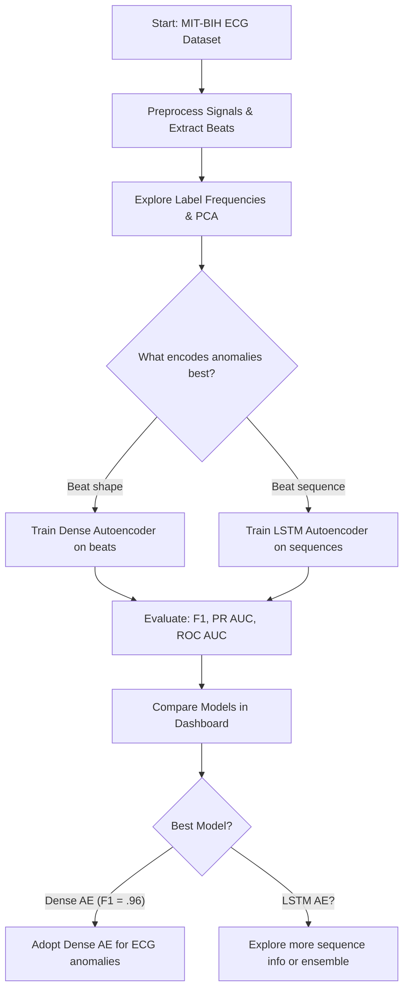

# MIT-BIH Arrhythmia Anomaly Detection

This project evaluates and compares anomaly detection strategies on the MIT-BIH Arrhythmia dataset, with the goal of understanding how different modeling approaches identify abnormal cardiac events. It is part of a broader effort to build a comprehensive portfolio of anomaly detection techniques across domains.

## Objective
To determine whether beat morphology or temporal sequence context better distinguishes anomalies in ECG signals.

---

## Project Roadmap

### 1. Data Setup & Preprocessing
- MIT-BIH Arrhythmia records: 100–104
- Applied filtering and segmentation:
  - Bandpass + Notch filter
  - RR interval calculation
  - Beat-centered window extraction

### 2. Exploratory Analysis
- Frequency spectra plots
- Label frequency & distribution
- PCA visualization of beat shape
- RR interval vs anomaly overlay

### 3. Modeling Approaches

#### Dense Autoencoder (Beat Shape)
- Trained on normal beats only
- Reconstruction error used as anomaly score
- Tuned threshold via F1 score

> **Result**: F1 = 0.9615  → Highly effective anomaly detection

#### LSTM Autoencoder (Beat Sequences)
- Constructed 5-beat sequences
- Flattened beat vectors
- Trained on sequences of normal beats

> **Result**: F1 = 0.3478 → Poor anomaly sensitivity

### 4. Evaluation & Dashboarding
- Saved outputs: `recon_error.npy`, `y_true.npy`, `metrics.json`
- Built a dashboard:
  - Summary metrics table
  - Bar plots of ROC/PR/F1
  - KDE plots of error by class

---

## Modeling Flow


---

## Repository Structure
```
.
├── data/
│   ├── raw/             # MIT-BIH downloaded records
│   ├── processed/       # Beat segments, labels, sequence 				windows for LSTM│
├── models/
│   ├── autoencoder/     # Trained dense AE model + metrics
│   └── lstm/            # Trained LSTM AE model + metrics
├── scripts/
│   ├── load_data.py
|   ├── extract.py
│   ├── preprocess.py
│   ├── evaluate.py
|   ├── plotting.py
|   ├── utils.py
│   ├── train_autoencoder.py
│   └── train_LSTM_autoencoder.py
├── notebooks/
│   ├── 00_data_survey.ipynb
|   ├── 01_data_exploration.ipynb
│   ├── 01b_LSTM_data_preparation.ipynb
│   ├── 02_dense_autoencoder_modeling.ipynb
│   ├── 02B_LSTM_modeling.ipynb
│   └── 03_model_comparison_dashboard.ipynb
```

---

## Insight
> **Beat morphology** proved more informative than sequence timing for detecting anomalies. The dense autoencoder outperformed the LSTM-based model significantly.

This project demonstrates the value of pairing structured evaluation with clear visualization and highlights how problem structure informs model selection in anomaly detection.

---

## Future Work
- Explore ensemble or hybrid methods
- Add heartbeat reconstructions vs originals
- Extend to additional records or datasets
- Test unsupervised clustering methods on PCA space

---

**Author**: Veronica Scerra  
**Part of the Anomaly Detection Portfolio Series**
